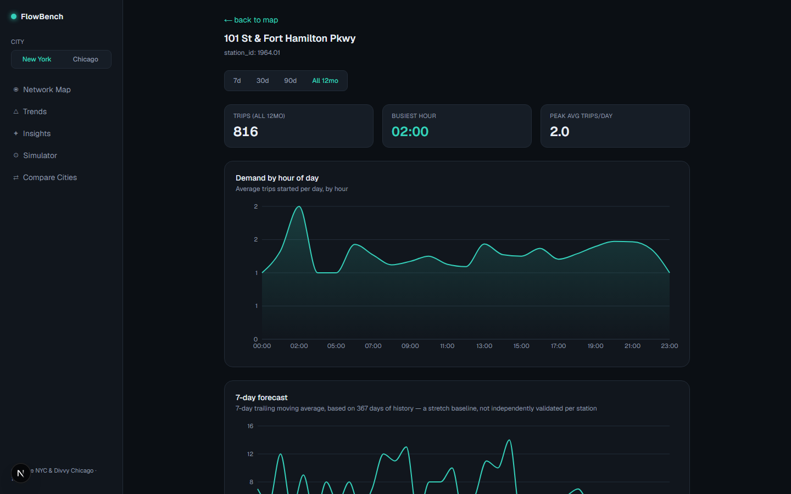
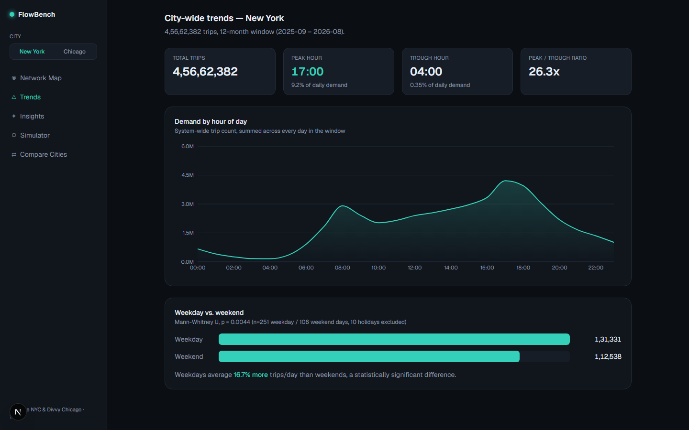
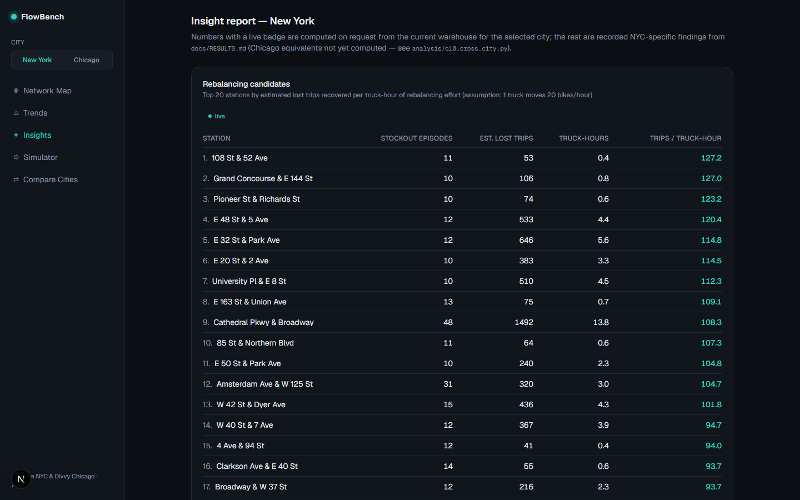
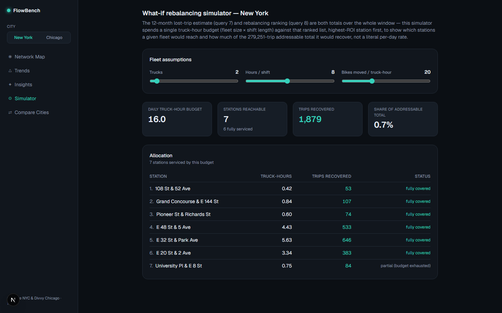
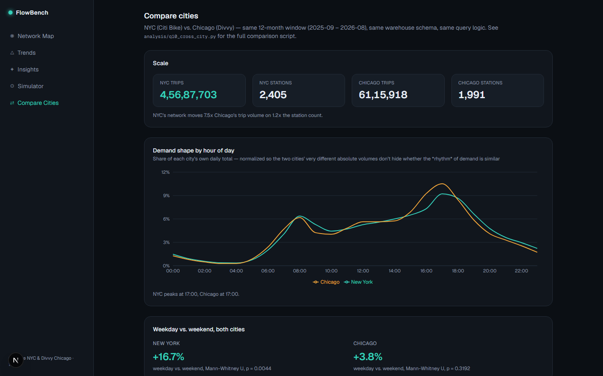

# FlowBench

Bike-share demand & network analytics warehouse, built on Citi Bike (NYC)
and Divvy (Chicago) public trip data. Answers one operational question:
**where and when does the station network run short of bikes or docks,
and how far in advance can that be seen coming?** — and, with two cities
in the warehouse, whether that pattern holds outside the network it was
first observed in.

**Headline finding**: the top 20 stations ranked by rebalancing ROI each
recover an estimated **90–130 lost trips per truck-hour** of rebalancing
effort — a concrete, ROI-ordered answer to "send the truck where first,"
not just "the network is imbalanced." Full numbers, confidence intervals,
and the cross-city comparison: [docs/RESULTS.md](docs/RESULTS.md).

This is a portfolio project targeting **Data Analysis** roles primarily
(secondary: SWE / Full Stack). Full rationale, scope, and role-fit
argument: [new-project-proposal.md](new-project-proposal.md).

## Status

✅ **Deployed** — Phases 1–7 complete (data, warehouse, analysis, API,
dashboard, write-up, deployment): 51.8M
trips across two cities (45.7M NYC Citi Bike + 6.1M Chicago Divvy) staged
into a star-schema warehouse, a 10-query analysis library (including a
cross-city comparison), a read-only FastAPI service, and a Next.js
dashboard (map, station detail, trends, insight report, simulator, city
switcher, cross-city comparison), live on Vercel + Render + Neon. See [docs/PROGRESS_LOG.md](docs/PROGRESS_LOG.md) for the live
status, [docs/RESULTS.md](docs/RESULTS.md) for numbers, and
[docs/PHASE_PLAN.md](docs/PHASE_PLAN.md) for what's next.

## Stack

- **Data**: Citi Bike (NYC) and Divvy (Chicago) trip data (both public, no API key)
- **Warehouse**: PostgreSQL + PostGIS
- **Transform**: plain versioned SQL (dbt-core optional, see [ADR-0002](docs/DECISIONS.md))
- **API**: FastAPI (read-only)
- **Frontend**: Next.js + TypeScript + Recharts + MapLibre GL
- **Infra**: Docker Compose (local), Neon/Supabase (Postgres), Render (API), Vercel (frontend) — all free-tier

## Architecture

```
Citi Bike / Divvy CSVs (public, no key)
        │  etl/download_and_load.py
        ▼
stg_trips_raw (Postgres)
        │  warehouse/migrations + transforms (plain SQL, versioned)
        ▼
star schema: fact_trips, dim_station, dim_time, dim_user_type, dim_city
        │  + materialized rollups (station_hourly_balance, demand_by_hour,
        │    rebalancing_candidates, trips_by_day, station_typology)
        ▼
analysis/ (10 query .sql/.py pairs) ──► docs/RESULTS.md findings
        │
        ▼
api/ (FastAPI, read-only, pooled connections)
        │  JSON over HTTP
        ▼
dashboard/ (Next.js 16 App Router, Recharts, MapLibre GL)
```

Read-only API surface (`api/main.py`):

| Endpoint | Purpose |
|---|---|
| `GET /cities` | Per-city trip/station counts, for the city switcher |
| `GET /stations` | Station list with typology and coordinates |
| `GET /stations/{id}/demand?range=` | Per-station demand curve (7d/30d/90d/all-time) |
| `GET /stations/{id}/forecast` | 7-day moving-average short-horizon forecast |
| `GET /network/demand` | System-wide hourly demand |
| `GET /network/imbalance?hour=` | Per-station inflow/outflow imbalance at a given hour |
| `GET /insights/weekday-vs-weekend` | Live Mann-Whitney U test on trip duration |
| `GET /insights/rebalancing-candidates` | ROI-ranked stations for truck rebalancing |
| `GET /insights/rebalancing-simulator?trucks=&hours_per_shift=&bikes_per_truck_hour=` | Greedy budget-allocation what-if simulator |

Dashboard routes (`dashboard/src/app/`):

| Route | Purpose |
|---|---|
| `/` | Map — stations colored by imbalance or typology, hour-of-day slider |
| `/stations/[id]` | Station detail — demand curve + forecast |
| `/trends` | City-wide hourly demand + weekday/weekend comparison |
| `/insights` | Rebalancing ranking + weekday/weekend test + Phase 3 findings |
| `/simulator` | "What-if" rebalancing simulator with live sliders |
| `/compare` | Cross-city comparison (NYC vs. Chicago) |

**Live demo** (all on free tiers):

- Dashboard: https://flowbench-eight.vercel.app
- API docs: https://flowbench-api-c2z8.onrender.com/docs

The API runs on Render's free tier and sleeps after ~15 minutes idle, so
the first request after a quiet period can take 30–50 seconds. Production
Postgres (Neon, free tier) holds only the precomputed rollup tables and
dimensions (~144 MB); the 17 GB raw `fact_trips` table stays local, and
no live endpoint queries it. A one-page PDF version of the insight report
below is at [docs/flowbench-insight-report.pdf](docs/flowbench-insight-report.pdf).

## Screenshots

| Station detail — demand curve + forecast | City-wide trends |
|---|---|
|  |  |

| Insight report — rebalancing ranking | What-if rebalancing simulator |
|---|---|
|  |  |

| Cross-city comparison (NYC vs. Chicago) |
|---|
|  |

The map view (`/`) isn't pictured here — its WebGL basemap didn't render
under headless browser automation in this pass; it renders correctly in
a normal browser at `localhost:3000`.

## Docs

| Doc | Purpose |
|---|---|
| [new-project-proposal.md](new-project-proposal.md) | Original pitch — why this project, why now |
| [docs/SPEC.md](docs/SPEC.md) | Detailed technical specification |
| [docs/PHASE_PLAN.md](docs/PHASE_PLAN.md) | Phase-by-phase implementation plan with checkboxes |
| [docs/PROGRESS_LOG.md](docs/PROGRESS_LOG.md) | Dated log of what happened, decisions made, diversions from plan |
| [docs/BUG_TRACKER.md](docs/BUG_TRACKER.md) | Known issues, open/closed |
| [docs/DECISIONS.md](docs/DECISIONS.md) | Architecture Decision Records (ADRs) |
| [docs/RESULTS.md](docs/RESULTS.md) | Living scoreboard — real numbers and findings as they land |

## Repo layout

```
flowbench/
├── docs/                  # this documentation suite
├── data/                  # raw/staging data (gitignored, not committed)
├── etl/                   # Python ELT scripts + data-quality checks
├── warehouse/             # SQL migrations, star schema, materialized views
├── analysis/              # Phase 3 analytical query library (SQL + Python runners)
├── api/                   # FastAPI read-only query layer
├── dashboard/             # Next.js dashboard
└── docker-compose.yml
```
